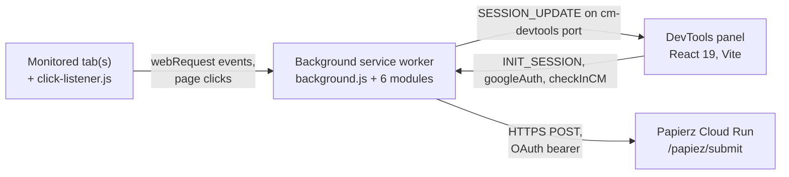

# Google CM Code Monitor

Internal AdOps Chrome extension (Manifest v3) for live inspection of Google Campaign Manager tracking pixels. It captures every `trackimp` and `trackclk` request fired from a monitored tab, validates the codes against Google Campaign Manager via the Papierz Cloud Run service, surfaces creatives missing `urlgdpr`, and groups duplicate impressions/clicks via Simple View.

## Features

- Live network capture across the monitored tab and any child tabs it spawns (popups, link follows, navigations).
- Campaign Manager validation: each captured `trackimp`/`trackclk` is enriched with creative metadata (site, campaign, placement, ad, creative) pulled from CM via OAuth.
- GDPR check: rows where Papierz reports a missing `urlgdpr` are highlighted in red.
- Impression / click pairing by shared identifier (`dc_trk_cid` → `trk_aid` → `dc_trk_aid` → `cid`).
- Simple View: collapses duplicates of the same creative into one representative row keyed on `(type, /B<advertiser>.<placement>, dc_trk_aid, dc_trk_cid, ord)`, hiding rows that came back from Papierz with "no data".
- `CLICK_BEFORE_INTERACTION` heuristic flags `trackclk` requests fired before any user click on the tab - a signal for autoclickers / inflated metrics.
- Persistent UI state: filter text, column widths, detail-panel width, and toggle states are saved to `chrome.storage.local`.

## Quickstart

```bash
# 1. Install panel dependencies
cd devtools-panel && npm install

# 2. Build the extension (run from repo root)
cd .. && npm run build

# 3. Load dist/ as an unpacked extension
#    chrome://extensions/ → toggle Developer mode → "Load unpacked" → select dist/
```

Then open DevTools on any page that fires CM tracking calls and switch to the **CM Monitor** tab. See [`docs/development.md`](docs/development.md) for the full setup, build, and reload workflow.

## Architecture at a glance



- **Monitored tab(s)** - any tab opened with DevTools on the CM Monitor panel, plus any child tabs it spawns. A small content script (`click-listener.js`) reports the first user click.
- **Background service worker** - owns network capture (`webRequest`), tab tracking (`tabs`, `webNavigation`), OAuth (`chrome.identity`), and the Papierz call. State lives in memory, scoped to the root tab.
- **DevTools panel** - React app loaded from `panel-dist/index.html`. Connects to the worker via `chrome.runtime.connect({ name: 'cm-devtools' })` and renders a Network-tab-style table.
- **Papierz** - external Cloud Run service that takes a list of CM URLs plus an OAuth token and returns creative metadata + a `view`/`click` bucket assignment. URL pinned in [`background/constants.js`](background/constants.js).

See [`docs/architecture.md`](docs/architecture.md) for the full breakdown.

## Repository layout

```
adops-tests-automation-extension/
├── manifest.json              # Chrome MV3 manifest, OAuth config, pinned key
├── background.js              # Service-worker entry; loads the six background/ modules
├── background/                # Service-worker modules (see docs/architecture.md)
│   ├── constants.js           # Papierz URL, tab-color palette, timeline-flag name
│   ├── authManager.js         # OAuth via chrome.identity, token refresh, logout
│   ├── tabManager.js          # webRequest + tab tracking, content-script injection
│   ├── sessionStore.js        # In-memory per-root-tab session state, panel broadcast
│   ├── papiezService.js       # Papierz POST, response → cmCode.papiez fan-out
│   └── messageRouter.js       # Port + runtime message dispatch
├── click-listener.js          # Content script: reports first user click per tab
├── devtools.html              # DevTools-page shim that loads devtools.js
├── devtools.js                # Registers the "CM Monitor" panel
├── devtools-panel/            # React 19 + Vite app rendered inside the panel
│   ├── src/App.jsx            # Single-file UI (request table, detail overlay, filters)
│   ├── src/App.css            # Panel styling
│   └── vite.config.js         # outDir: ../dist/panel-dist
├── scripts/
│   └── build-extension.js     # Cleans dist/, runs vite build, copies static files
└── dist/                      # Build output. Load this folder in chrome://extensions.
```

## Documentation

- [`docs/architecture.md`](docs/architecture.md) - runtime topology, message contract, session-state shape, OAuth flow, Papierz request/response, storage keys reference.
- [`docs/development.md`](docs/development.md) - prerequisites, build, Chrome reload workflow, debugging the worker / panel / content script, OAuth allowlisting, troubleshooting.
