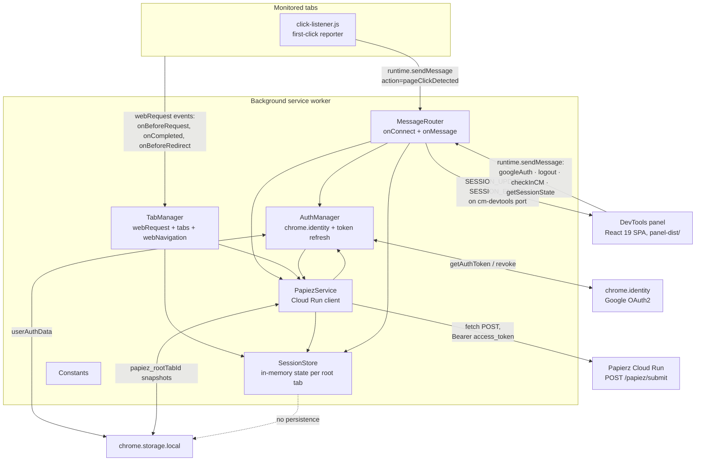
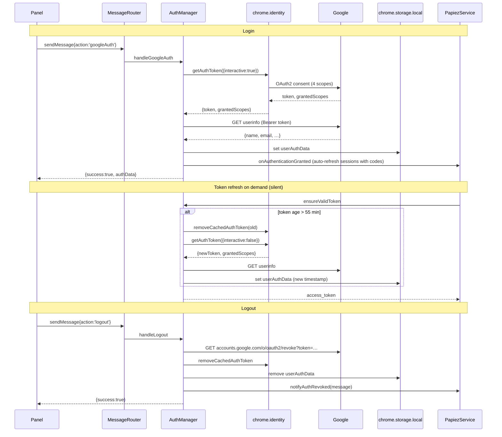

# Architecture

This document describes how the extension is wired at runtime. It is the reference a developer should read before changing capture behaviour, the message contract, the OAuth flow, or the Papierz integration.

## Runtime topology



Two things to note from this diagram:

1. **Session state is in-memory only.** It lives in `SessionStore.sessions` (a `Map<rootTabId, session>`), is created when the panel sends `INIT_SESSION`, and is destroyed when the root tab is closed (`tabManager.detachTab` → `SessionStore.destroySession`). The MV3 service worker can be terminated by Chrome between events, which means a panel reconnect after an idle period sees an empty session unless the tab kept firing requests.
2. **Papierz snapshots are persisted per root tab.** Each successful Papierz call writes its raw response under `papiez_<rootTabId>` so a fresh DevTools open can rehydrate creative metadata immediately ([`background/papiezService.js:13`](../background/papiezService.js)).

## Background service worker

`background.js` is a tiny entry point that loads six modules via `importScripts` (lines 1-8) and wires them up. Each module is an IIFE that attaches a single object to `self`. Inter-module access goes through those globals (e.g. `self.SessionStore`).

| Module | Purpose | Key entry points |
|---|---|---|
| [`background/constants.js`](../background/constants.js) | Frozen runtime constants. | `CM_API_ENDPOINT`, `TIMELINE_FLAG_CLICK_BEFORE_INTERACTION`, `TAB_COLOR_PALETTE`, `PAPIEZ_STORAGE_PREFIX` |
| [`background/sessionStore.js`](../background/sessionStore.js) | Owns the per-root-tab session map and the panel-port registry. Serializes session state for the panel and broadcasts updates. | `ensureSession`, `serializeSession` (line 119), `broadcastSessionUpdate` (line 190), `destroySession` (line 215) |
| [`background/authManager.js`](../background/authManager.js) | OAuth lifecycle: login, refresh, logout, profile fetch. | `handleGoogleAuth`, `handleLogout`, `ensureValidToken`, `refreshAccessToken` |
| [`background/papiezService.js`](../background/papiezService.js) | Papierz client: builds the request, debounces auto-refresh, fans the response into `cmCode.papiez`, persists snapshots. | `runPapiezCheck` (line 132), `applyPapiezResults` (line 44), `schedulePapiezRefresh` (line 107), `loadPapiezSnapshot` (line 13) |
| [`background/tabManager.js`](../background/tabManager.js) | Network capture, tab attach/detach, click-listener injection, redirect tracking. | `initializeEventListeners` (line 249), `attachTab`, `handleNetworkRequest` (line 105), `isCmTrackingUrl` (line 90) |
| [`background/messageRouter.js`](../background/messageRouter.js) | Single dispatcher for both the long-lived port from the panel and one-shot runtime messages. | `handlePortConnection`, `handleRuntimeMessage` |

## Request capture rules

`TabManager.handleNetworkRequest` runs for every `webRequest.onBeforeRequest` on `<all_urls>` ([`tabManager.js:250`](../background/tabManager.js)). The request is recorded only if the originating tab is mapped to a session (i.e. an attached tab).

**CM classification.** A request is a CM tracking pixel iff:

- `URL.hostname === 'ad.doubleclick.net'`, **and**
- `URL.pathname` matches `^/(ddm/)?(trackclk|trackimp)` (so both modern `/ddm/trackclk/...` and legacy `/trackclk/...` formats qualify).

See [`tabManager.js:90-103`](../background/tabManager.js).

The `type` field on each request entry is one of:

- `'trackclk'` - pathname contains `trackclk`.
- `'trackimp'` - pathname contains `trackimp`.
- `'general'` - neither (i.e. not a CM pixel).

**`isCmCode`** mirrors the predicate above. Only `isCmCode: true` rows are clickable in the panel and only those URLs are sent to Papierz.

**`duplicateCount`** is the running count of how many times the same URL has been seen in the current session. The count lives on `session.cmCodes.get(url).count` and is incremented on each hit ([`tabManager.js:140`](../background/tabManager.js)). Two impressions with identical query strings count as duplicates; Simple View on the panel side collapses these.

**`isAdRequest`** is a looser signal - `url.includes('ad.d') || url.includes('doubleclick')`. It drives the "Ad requests" stat chip but is not used for CM classification.

**`isChildRequest`** is `true` when the request originated from a child tab (i.e. `tabId !== rootTabId`). Child tabs get attached automatically via `chrome.tabs.onCreated` (opener relationship) and `chrome.webNavigation.onCommitted` / `onCreatedNavigationTarget`, with a transition-type allowlist of `link`, `auto_toplevel`, `form_submit`, `generated` to skip noise like reloads ([`tabManager.js:312-337`](../background/tabManager.js)).

**`timelineFlag = 'CLICK_BEFORE_INTERACTION'`** fires when a `trackclk` arrives and `session.tabsWithClicks.size === 0` - i.e. the click pixel was sent before the user clicked anything on the tab. This is a heuristic for autoclickers and inflated CTR. The flag is set per-request, not per-code, so once the user clicks, subsequent `trackclk` rows are unflagged.

**HTTP status** is captured separately on `webRequest.onCompleted` and patched onto the existing entry by `requestId` ([`tabManager.js:175`](../background/tabManager.js)). 302 redirects are special-cased by `handleRequestRedirect` to record the landing URL on the matching CM code (used by the panel to extract UTM parameters from the post-redirect destination).

## Session state shape

The shape broadcast to the panel is produced by `SessionStore.serializeSession` ([`sessionStore.js:119-188`](../background/sessionStore.js)). Top-level fields:

| Field | Type | Notes |
|---|---|---|
| `rootTabId` | number | Anchors the whole session. |
| `preserveLog` | boolean | If false, navigations on the root tab clear `requests` + `cmCodes`. Persisted in `cm_monitor_preserve_log`. |
| `totals` | `{ totalRequests, adRequests, uniqueCmCodes }` | Drives the stat chips. |
| `requests[]` | array of request entries | See below. Order = chronological. |
| `cmCodes[]` | array of CM-code summaries | Per-URL aggregate. See below. |
| `trackedTabs[]`, `childTabs[]`, `tabOrigins[]`, `tabsWithClicks[]`, `tabUrls[]`, `tabs[]` | various tab-tracking arrays | The panel mostly reads `tabs[]` (consolidated form). |
| `papiez` | `{ inFlight, lastRunAt, lastError, source }` | Drives the auto-refresh status and the "Refreshing Papierz…" indicator. |

**Request entry** (one per captured `webRequest.onBeforeRequest`):

```ts
{
  id: string,            // Chrome's requestId
  sequence: number,      // 1-indexed within the session
  url: string,
  tabId: number,
  originTabId: number,
  timestamp: number,     // Date.now()
  type: 'trackclk' | 'trackimp' | 'general',
  isAdRequest: boolean,
  isCmCode: boolean,
  duplicateCount: number,
  timelineFlag: 'CLICK_BEFORE_INTERACTION' | null,
  isChildRequest: boolean,
  tabColor: string | null,    // hex from TAB_COLOR_PALETTE
  statusCode: number | null,  // populated on onCompleted; null until then
}
```

**CM code summary** (one per unique CM URL):

```ts
{
  url: string,
  count: number,                // duplicateCount alias
  type: 'trackclk' | 'trackimp',
  firstSeenAt: number,
  lastSeenAt: number,
  redirectUrl: string | null,   // captured from onBeforeRedirect, used by the detail overlay
  originTabs: number[],
  papiez: {
    bucket: 'click' | 'view',
    lastFetchedAt: number,
    source: 'auto' | 'manual' | 'restore',
    error: string | null,       // 'No data returned from Papierz.' or API-supplied error_msg
    data: object | null,        // Papierz response.response field (creative metadata)
  } | null,
}
```

## DevTools panel

The panel is a single React 19 component (`devtools-panel/src/App.jsx`) loaded from `panel-dist/index.html`. It connects to the worker on mount:

```js
chrome.runtime.connect({ name: 'cm-devtools' })
  → port.postMessage({ type: 'INIT_SESSION', rootTabId })
  → port.onMessage: SESSION_UPDATE | SESSION_ENDED | SESSION_ERROR
```

UI state persisted in `chrome.storage.local`:

| Key | Type | Purpose |
|---|---|---|
| `cm_monitor_filter_settings` | string | Filter text in the search box. |
| `cm_monitor_show_only_cm_codes` | boolean | "Tylko CM codes" toggle. |
| `cm_monitor_simple_view` | boolean | "Simple view" dedup toggle. |
| `cm_monitor_column_widths` | object | Per-column widths in pixels (`{type, adId, url, gdpr, status, duplicates, time}`). |
| `cm_monitor_panel_width` | number | Right-side detail-panel width in pixels (clamped 280-800). |

Column resizing and panel resizing are implemented with two near-identical custom hooks (`useColumnResize`, `usePanelResize` in `App.jsx`). Widths are written to storage on every drag tick - debouncing is unnecessary because writes go through the chrome.storage extension API which is itself debounced and the UI does not re-render on storage writes.

## OAuth flow



**Scopes requested** ([`manifest.json:31-36`](../manifest.json)):

| Scope | Why it's needed |
|---|---|
| `https://www.googleapis.com/auth/dfareporting` | Read access to Campaign Manager reporting data - the Papierz backend uses this scope to look up creative metadata. |
| `https://www.googleapis.com/auth/dfatrafficking` | Trafficking access - needed for placement/ad/creative lookups beyond what reporting alone exposes. |
| `https://www.googleapis.com/auth/userinfo.email` | Show the signed-in user's email in the panel. |
| `https://www.googleapis.com/auth/userinfo.profile` | Show the signed-in user's display name in the panel. |

**Token lifetime.** Google access tokens are valid for ~1 hour. `AuthManager` uses a 55-minute window (`TOKEN_REFRESH_WINDOW`, [`authManager.js:2`](../background/authManager.js)) to refresh proactively. If silent refresh fails, the panel sees `lastError: 'Authentication expired. Please login again.'` and the user must click Login again.

**Storage.** The full auth blob lives at `chrome.storage.local.userAuthData`:

```ts
{
  access_token: string,
  scopes: string[],
  user_info: { name, email, picture, … } | null,
  timestamp: number,    // Date.now() at issue/refresh
}
```

## Papierz integration

**Endpoint:** `POST` to the URL pinned in [`background/constants.js:3-4`](../background/constants.js):

```
https://adops-tests-automation-niedzwiedz-ze-mna-application-…us-central1.run.app/papiez/submit
```

**Request body** (built in [`papiezService.js:163-173`](../background/papiezService.js)):

```json
{
  "codes": ["https://ad.doubleclick.net/ddm/trackclk/…", "…"],
  "auth": {
    "access_token": "<bearer>",
    "scopes": ["https://www.googleapis.com/auth/dfareporting", "…"]
  },
  "metadata": {
    "test_urls": ["https://example.com/landing", "…"],
    "timestamp": "2026-04-28T12:34:56.789Z"
  }
}
```

`codes` is the list of every URL in `session.cmCodes` whose `type` is `trackclk` or `trackimp` (no other URLs are sent). `metadata.test_urls` is every monitored tab's current URL.

**Response shape:**

```json
{
  "click": [
    { "link": "<original CM URL>", "response": { /* creative metadata */ }, "error_msg": null }
  ],
  "view": [
    { "link": "<original CM URL>", "response": { /* … */ }, "error_msg": null }
  ]
}
```

**Fan-out.** `applyPapiezResults` ([`papiezService.js:44`](../background/papiezService.js)) walks both buckets and writes each item onto the matching `session.cmCodes.get(item.link).papiez`. Codes that were sent but came back in neither bucket get a synthetic `{error: 'No data returned from Papierz.', data: null}` so the panel can distinguish "not yet checked" (`papiez === null`) from "checked, no data".

The `response` payload is what the panel renders in the "Szczegóły reklamy (Papierz)" table: `site_name`, `campaign_name`, `placement_name`, `ad_name`, `creative_name`, `urlpartnerid`, `urlgdpr`, `urlgdpr_consent`. The GDPR check is `urlgdpr` truthy/non-empty.

**Trigger paths:**

- **Auto** - every captured CM URL schedules a debounced refresh via `schedulePapiezRefresh` (debounce 600 ms, [`papiezService.js:122`](../background/papiezService.js)). If a refresh is already in flight when another request arrives, `state.dirty = true` and a follow-up refresh fires once the current one finishes.
- **Manual** - the panel's "Check in CM" button sends `{action: 'checkInCM'}` which routes to `runPapiezCheck(session, 'manual', sendResponse)`. The `source` field on the response distinguishes auto/manual/restore.
- **Restore** - on tab attach, `loadPapiezSnapshot` reads `papiez_<rootTabId>` from storage and replays the last successful response without re-fetching ([`tabManager.js:41`](../background/tabManager.js)).

## Message contract

### Port messages (long-lived, `chrome.runtime.connect({name: 'cm-devtools'})`)

| Direction | Type | Payload | Notes |
|---|---|---|---|
| Panel → Worker | `INIT_SESSION` | `{ rootTabId: number }` | First message after connect. Triggers `attachTab` and an immediate `SESSION_UPDATE`. |
| Panel → Worker | `SET_PRESERVE_LOG` | `{ value: boolean }` | Toggles preserve-log; persisted in `cm_monitor_preserve_log`. Disabling clears requests and CM codes. |
| Panel → Worker | `CLEAR_SESSION` | `{}` | Drops requests, CM codes, and click history; broadcasts. |
| Worker → Panel | `SESSION_UPDATE` | `{ payload: SessionState }` | Sent on every state change (request capture, Papierz progress, tab attach/detach). |
| Worker → Panel | `SESSION_ENDED` | `{ rootTabId }` | Root tab closed. |
| Worker → Panel | `SESSION_ERROR` | `{ error: string }` | Attach failure or invalid `INIT_SESSION`. |

### Runtime messages (one-shot, `chrome.runtime.sendMessage`)

| Direction | Action | Request payload | Response |
|---|---|---|---|
| Panel → Worker | `googleAuth` | `{}` | `{success, authData?, error?}` |
| Panel → Worker | `logout` | `{}` | `{success, error?}` |
| Panel → Worker | `checkInCM` | `{ rootTabId }` | `{success, data?, error?}` (data = full Papierz response) |
| Panel → Worker | `getSessionState` | `{ rootTabId }` | `{success, payload?, userAuthData?}` |
| Content → Worker | `pageClickDetected` | `{}` | `{success: true}` (sender's `tab.id` flips that tab's `tabsWithClicks` bit) |

The dispatch table is in [`messageRouter.js:71-93`](../background/messageRouter.js); add new actions there.

## Storage keys reference

All keys live in `chrome.storage.local`. Session state is **not** persisted - only the entries below survive a worker restart or a Chrome restart.

| Key | Type | Writer | Reader | Purpose |
|---|---|---|---|---|
| `userAuthData` | object | `authManager.js` | `authManager.js`, `App.jsx` (read-only on `getSessionState`) | OAuth bearer + scopes + profile + issue timestamp. |
| `cm_monitor_preserve_log` | boolean | `messageRouter.js:39` | `tabManager.js:33` (on attach) | Persists the Preserve Log toggle across DevTools sessions. |
| `cm_monitor_filter_settings` | string | `App.jsx` | `App.jsx` | Search-box text. |
| `cm_monitor_show_only_cm_codes` | boolean | `App.jsx` | `App.jsx` | "Tylko CM codes" toggle. |
| `cm_monitor_simple_view` | boolean | `App.jsx` | `App.jsx` | "Simple view" dedup toggle. |
| `cm_monitor_column_widths` | object | `App.jsx` | `App.jsx` | Column widths in the request table. |
| `cm_monitor_panel_width` | number | `App.jsx` | `App.jsx` | Right-side detail-panel width. |
| `papiez_<rootTabId>` | object | `papiezService.js:95` | `papiezService.js:13` (on attach) | Per-tab Papierz response snapshot for instant rehydration. Removed on tab close. |

## Content script: `click-listener.js`

`TabManager.attachTab` injects `click-listener.js` into every monitored tab via `chrome.scripting.executeScript` ([`tabManager.js:44-51`](../background/tabManager.js)) and re-injects on every `chrome.tabs.onUpdated` with `status === 'complete'` to survive same-tab navigations. The script:

1. Bails if `window.__cmClickListenerAttached` is already set (idempotent against double-injection from racing events).
2. Attaches a single capture-phase `click` listener to `window` with `{capture: true, once: true}` - fires once per page load, then garbage-collects itself.
3. Sends `{action: 'pageClickDetected'}` to the worker. The worker reads `sender.tab.id` and adds it to `session.tabsWithClicks`.
4. Swallows `Extension context invalidated` errors silently - these happen when the developer reloads the extension while the page is still open.

The signal is consumed by `handleNetworkRequest` to decide whether to set `timelineFlag = 'CLICK_BEFORE_INTERACTION'` on incoming `trackclk` rows.
